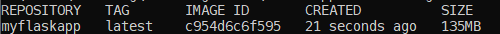

# Learning Docker

## Dockerizing Flask app

### 1. Flask app

- Taking the flask simple code from flask documentation

### 2. Dockerfile

- Dockerfile makes working directory and installs dependcies and runs the app.

### 3. Making Docker image

- `docker build -t myflaskapp .`
  - `docker build -t image_name Dockerfile_directory_path`

-- Check the images as
`docker images`

### 4. Making a Docker Container

- `docker run -p 5000:5000 myflaskapp`

## It displays the IP localhost that links to Flask page as:

And the page looks like:

