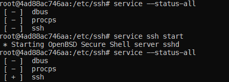
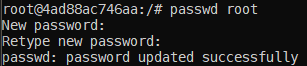
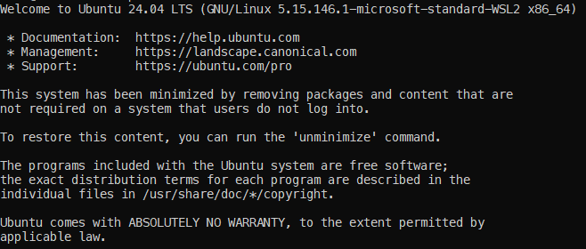

# Learning Docker

## Connecting 2 Ubuntu Servers with SSH

- `docker pull ubuntu`

  - pulling ubuntu from docker hub

### Ubuntu server with name 'container1' will be created with SSH started.

here, it means interactive mode.

- `docker run -it --name container1 ubuntu`
  - `docker run -it --name container_name image_name`

Steps now:

1. Installing SSH in the container

   - `apt-get install`
   - `apt-get install openssh-server`

   - `apt-get install nano`

   `nano /etc/ssh/sshd_config`

Then we can see the SSH in the services section.
with command:
"`service --status-all`"

- can be started by: `service ssh start`

  -

* SSH service is started in one Ubuntu server.

### Making a second Ubuntu container

`docker run -it --name container2 ubuntu `

{installing client in container2 }

- `apt-get install openssh-client`

## Checking the ssh interactions now

1. Starting container 1

   - `docker start container1`

2. Getting password of the server in container1

   - `docker exec -it container1 bash`

   -- getting the password

   - `cat /etc/shadow | grep root`

     -- This is too tough.
     So, changing the password as:

   - `passwd root`
     

3. Checking IP of container1

   - `docker inspect container1 | grep IPAddress`
     -- gives the IP of container1
   - `service start ssh` for container1

4. Starting container2 and communicating with container`

   - `docker start container2`
   - `docker exec -it container2 bash`

   - calling container1 as
     `ssh root@IP_of_container1`

## Hence, we can see the ssh is connected from one Ubuntu container to another Ubuntu container.

