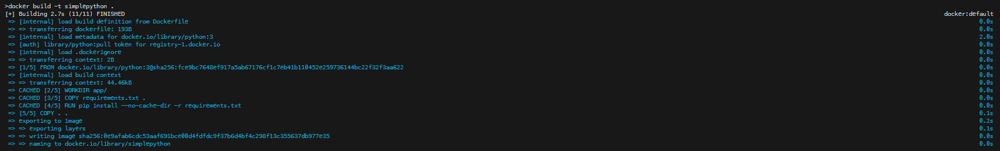
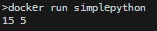

# Simple Python Program to Demonstrate Working of Docker

1. Building Dockerfile

   - `docker build -t simplepython .`

2. Building Docker Image

   

3. Running Docker Container!

   

## Hence, Docker is implemented with basic addition and subtraction functions in python.
